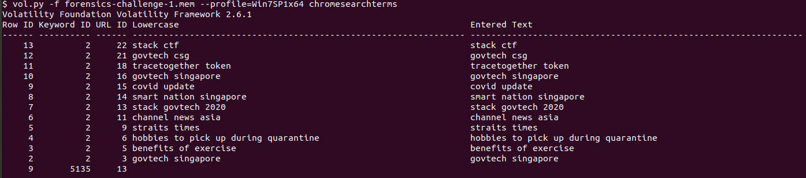
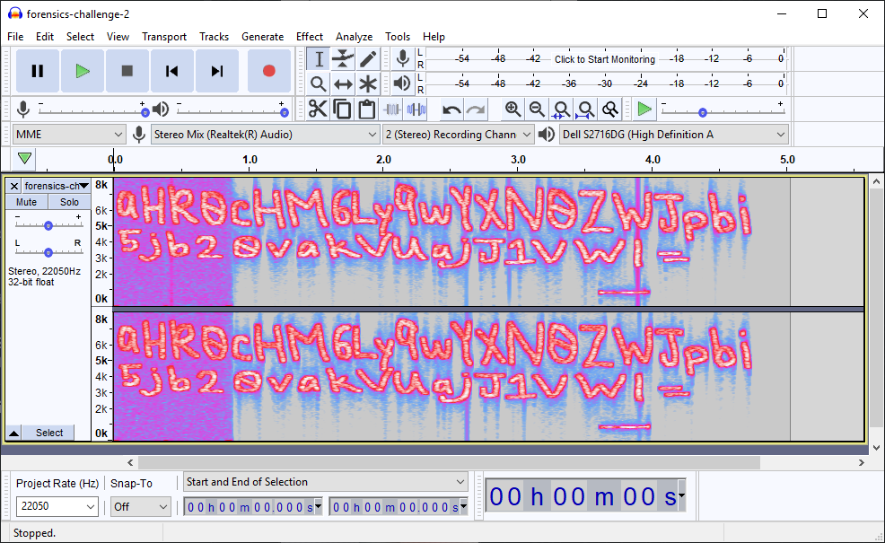

# Writeups - Forensics

## Challenges

| S/N                              | Real Name                                                    |
| -------------------------------- | ------------------------------------------------------------ |
| forensics-challenge-1            | [Walking down a colourful memory lane](#walking-down-a-colourful-memory-lane) |
| forensics-challenge-2            | [Voices in the head](#voices-in-the-head)                    |
| forensics-challenge-3 (unsolved) | Corrupted Hive                                               |
| forensics-challenge-4 (unsolved) | Our Drive is encrypted!                                      |

## Walking down a colourful memory lane

1000 FORENSICS

**DESCRIPTION**

We are trying to find out how did our machine get infected. What did the user do?

This challenge:

- Is eligible for Awesome Write-ups Award
- Prerequisite for Mastery Award - Forensicator

---

We are given memory image `forensics-challenge-1.mem `.

```bash
$ file forensics-challenge-1.mem 
forensics-challenge-1.mem: data
$ ls -al forensics-challenge-1.mem 
-rwxrw-rw- 1 sansforensics sansforensics 2147483648 Dec  4 13:06 forensics-challenge-1.mem
```

As is customary for memory images we shall use [volatility](https://github.com/volatilityfoundation/volatility) for memory analysis, and we start by running the [imageinfo](https://github.com/volatilityfoundation/volatility/wiki/Command-Reference#imageinfo) plugin on the memory dump to determine the memory profile to use for analyis.

```bash
$ vol.py -f forensics-challenge-1.mem imageinfo
Volatility Foundation Volatility Framework 2.6.1
INFO    : volatility.debug    : Determining profile based on KDBG search...
          Suggested Profile(s) : Win7SP1x64, Win7SP0x64, Win2008R2SP0x64, Win2008R2SP1x64_24000, Win2008R2SP1x64_23418, Win2008R2SP1x64, Win7SP1x64_24000, Win7SP1x64_23418
                     AS Layer1 : WindowsAMD64PagedMemory (Kernel AS)
                     AS Layer2 : FileAddressSpace (/home/sansforensics/forensics-challenge-1.mem)
                      PAE type : No PAE
                           DTB : 0x187000L
                          KDBG : 0xf800029fb0a0L
          Number of Processors : 1
     Image Type (Service Pack) : 1
                KPCR for CPU 0 : 0xfffff800029fcd00L
             KUSER_SHARED_DATA : 0xfffff78000000000L
           Image date and time : 2020-12-03 09:12:22 UTC+0000
     Image local date and time : 2020-12-03 17:12:22 +0800
```

We get a few suggestions but shall go with the first one `Win7SP1x64`, also because we see that:

```
 Image Type (Service Pack) : 1
```

### pslist

Using [pslist](https://github.com/volatilityfoundation/volatility/wiki/Command-Reference#pslist) we get a basic process listing. 

We note that the recently spawned processes are

-  1x instance of `notepad.exe`
- 22x instances of `chrome.exe` with PID 2904 as parent process of the 21 others.

```bash
$ vol.py -f forensics-challenge-1.mem --profile=Win7SP1x64 pslist
```


### pstree

We don't observe any weird parent-child process relationships either.


let's take a look at notepad.txt.

We first use the [handles](https://github.com/volatilityfoundation/volatility/wiki/Command-Reference#handles) plugin to see if there are still any handles to FILES of interest, such as flags.

```bash
vol.py -f forensics-challenge-1.mem --profile=Win7SP1x64 handles -p 3896 --object-type=File --output=text --output-file=3896-handles-file.txt
```

In the output we see evidence of the user named `owlli`:

```
Offset(V)             Pid             Handle             Access Type             Details
------------------ ------ ------------------ ------------------ ---------------- -------
<snip>
\Device\HarddiskVolume1\Users\owlli\AppData\Local\Microsoft\Windows\Explorer\thumbcache_idx.db
0xfffffa801af8ead0   3896              0x660           0x12019f File             \Device\HarddiskVolume1\Users\owlli\AppData\Local\Microsoft\Windows\Explorer\thumbcache_32.db
0xfffffa801af8e700   3896              0x668           0x12019f File             \Device\HarddiskVolume1\Users\owlli\AppData\Local\Microsoft\Windows\Explorer\thumbcache_96.db
0xfffffa801af93800   3896              0x670           0x12019f File             \Device\HarddiskVolume1\Users\owlli\AppData\Local\Microsoft\Windows\Explorer\thumbcache_256.db
0xfffffa801af936b0   3896              0x678           0x12019f File             \Device\HarddiskVolume1\Users\owlli\AppData\Local\Microsoft\Windows\Explorer\thumbcache_1024.db
0xfffffa801af93560   3896              0x680           0x12019f File             \Device\HarddiskVolume1\Users\owlli\AppData\Local\Microsoft\Windows\Explorer\thumbcache_sr.db
```

There aren't any open handles to txt files or any another types of documents. But we can try an alternate method by dumping the process's memory using [memdump](https://github.com/volatilityfoundation/volatility/wiki/Command-Reference#memdump) and running a string search on that.

```bash
vol.py -f forensics-challenge-1.mem --profile=Win7SP1x64 memdump --dump-dir=./ -p 3896
```

- this produces our dump of notepad.exe's memory `3896.dmp`

We now take a look at strings containing the word `.txt`

```
$ strings 3896.dmp | grep -i '\.txt' | sort | uniq
[2020-12-03T08:51:27.144Z] [ message] [VGAuthService] 	 logfile=C:\\ProgramData\\VMware\\VMware VGAuth\\logfile.txt
AREYOU~1.TXT
are you sure.txt
Content-Disposition: attachment; filename="f.txt"
Driver da Microsoft para arquivos texto (*.txt; *.csv)
found at http://polymer.github.io/PATENTS.txt
hints.txt
ISEE~1.TXT
i see.txt
Microsoft Text Driver (*.txt; *.csv)
Microsoft Text-Treiber (*.txt; *.csv)
stack is fun.txt
THISMI~1.TXT
thismightbetheone.txt
t.txt
.txt
.txt`
.TXTw
whattt.txt
```

most notably are the entries

```
are you sure.txt
hints.txt
stack is fun.txt
thismightbetheone.txt
whattt.txt
```

- these look promising.

We end up with 5 candidate text files for further investigation but how can we see the contents within?

We turn to the plugin [mftparser](https://github.com/volatilityfoundation/volatility/wiki/Command-Reference#mftparser), which scan for [MFT (Master File Table)](https://en.wikipedia.org/wiki/Master_File_Table) entries in memory.

To understand why looking at MFT entries might allow us to look into the content of files is the MFT concept of <u>resident files</u>. 

```
A file is resident when all its information, the complete data of the file, is housed only in the MFT. That is to say, that a resident file does not occupy space in disk,
```

- https://unminioncurioso.blogspot.com/2019/05/dfir-one-byte-makes-difference-mft.html

MFT entries are 1024 bytes long. Of this file metadata such as file names, timestamps takes up around 500 bytes of space. Sometimes when a file is quite small (<500 bytes of logical data), the file system will place the entire file within the MFT. 

```bash
vol.py -f forensics-challenge-1.mem --profile=Win7SP1x64 mftparser --output=text --output-file=mftparser.txt
```

we see the file content in the output of `mftparser`, under the `$DATA` attribute, lining up with what we said about resident files having their data stored in the MFT.


Unforunately, none of these turned up anything useful.

### chrome.exe

At this point we are tempted to see what kind of internet activity has been going on inside `chrome.exe`, and our first thoughts are to turn to the [chromehistory](https://blog.superponible.com/2014/08/31/volatility-plugin-chrome-history/) plugin, but before we do it is always a good idea to run the [iehistory](https://github.com/volatilityfoundation/volatility/wiki/Command-Reference#iehistory) plugin when investigating internet-related activity.

This [Volatility Labs blogpost](https://volatility-labs.blogspot.com/2012/09/howto-scan-for-internet-cachehistory.html) makes very compelling reasons for us to do so:

```
... but it is very important to remember that IE is not the only application to map sections of index.dat into memory. Any tool using IE through a COM object or even malware using Wininet APIs (such as InternetOpenUrl, InternetReadFile, HttpSendRequest, etc) will alter the cache/history; thus they may have portions of the data in memory.
```

- in short, [iehistory](https://github.com/volatilityfoundation/volatility/wiki/Command-Reference#iehistory) isn't necessarily only for Internet Explorer history!

 We get some interesting findings:

```bash
$ vol.py -f forensics-challenge-1.mem --profile=Win7SP1x64 iehistory
Volatility Foundation Volatility Framework 2.6.1
**************************************************
Process: 2460 explorer.exe
Cache type "URL " at 0x2905000
Record length: 0x100
Location: :2020120320201204: owlli@file:///C:/Users/owlli/Pictures/are%20you%20sure.txt
Last modified: 2020-12-03 16:26:42 UTC+0000
Last accessed: 2020-12-03 08:26:42 UTC+0000
File Offset: 0x100, Data Offset: 0x0, Data Length: 0x0
**************************************************
<snip>
Location: :2020120320201204: owlli@file:///C:/Users/owlli/Documents/hints.txt
<snip>
Location: :2020120320201204: owlli@file:///C:/Users/owlli/Pictures/whattt.txt
<snip>
Location: :2020120320201204: owlli@file:///C:/Users/owlli/Pictures/thismightbetheone.txt
...
```

- we see the txt files that we have see earlier in our analysis of notepad.txt

Unfortunately that's all that this plugin managed to show us for now, we move on to plugins focused for Google Chrome.

We run the [chromehistory](https://blog.superponible.com/2014/08/31/volatility-plugin-chrome-history/) plugin:


- Unfortunately this came up empty for us... not sure why ヽ(ಠ_ಠ) ノ

These plugins came up empty too:

- [chromevisits](https://blog.superponible.com/2014/08/31/volatility-plugin-chrome-history/#chromevisits)
- [chromedownloads](https://blog.superponible.com/2014/08/31/volatility-plugin-chrome-history/#chromedownloads)
- [chromedownloadchains](https://blog.superponible.com/2014/08/31/volatility-plugin-chrome-history/#chromedownloadchains)
- [chromecookies](https://blog.superponible.com/2014/08/31/volatility-plugin-chrome-history/#chromecookies)

However [chromesearchterms](https://blog.superponible.com/2014/08/31/volatility-plugin-chrome-history/#chromesearchterms) does come through for us, and we get confirmation that indeed some web activity was generated by the user.



Let's try to get the Chrome history file out of the memory dump.

First lets get a list of FILE_OBJECT memory structures using [filescan](https://github.com/volatilityfoundation/volatility/wiki/Command-Reference#filescan). We output to a separate file for easier searching.

```bash
$ vol.py -f forensics-challenge-1.mem --profile=Win7SP1x64 filescan --output=text --output-file=filescan.txt
Volatility Foundation Volatility Framework 2.6.1
Outputting to: filescan.txt
```

The output of the plugin is as follows

```
$ head -n 1 filescan.txt 
Offset(P)            #Ptr   #Hnd Access Name
```

Chrome history is stored in the `History` file at:

```
%LOCALAPPDATA%\Google\Chrome\User Data\Default\History
```

Lets grep for it:

```
$ grep -i 'Google\\Chrome\\User Data\\Default\\History' filescan.txt 
```


- We get a hit at physical offset `0x7f38d070` !

### file carving using dumpfiles

Now let's carve the `History` file out from memory using the [dumpfiles](https://github.com/volatilityfoundation/volatility/wiki/Command-Reference#dumpfiles) plugin

- `-Q` to specify the physical offset of the file
- `-D` to specify the output file directory
- `-n` to include extracted filenames in extracted files

```
$ vol.py -f forensics-challenge-1.mem --profile=Win7SP1x64 dumpfiles -Q 0x7f38d070 -D . -n
```


We get 2 files, and the one ending in `.dat` is the actual `History` file carved as it contains the mapped `DataSectionObject`.

```bash
$ file *
file.None.0xfffffa801998b780.History.vacb: empty
file.None.0xfffffa801a81fab0.History.dat:  SQLite 3.x database, last written using SQLite version 3033000
```

We can load `file.None.0xfffffa801a81fab0.History.dat` into a tool to view the history within, I chose to use [ChromeHistoryView](https://www.nirsoft.net/utils/chrome_history_view.html):


- We see activity from search queries that we saw earlier when we ran [chromesearchterms](https://blog.superponible.com/2014/08/31/volatility-plugin-chrome-history/#chromesearchterms),
- Activity to 2 other sites stands out, `pastebin.com` and `mediafire.com`

### Pastebin

```
https://pastebin.com/KeqPRaaY
```

- contains just the text `htesttttttttttt`, not much to see here

### Mediafire

```
http://www.mediafire.com/view/5wo9db2pa7gdcoc/
http://www.mediafire.com/view/5wo9db2pa7gdcoc/This_is_a_png_file.png/file
```

Tis a small picture.


Download it:


Lets take a look at the picture, or at least we try to:

```bash
$ file This\ is\ a\ png\ file.png 
This is a png file.png: PNG image data, 64 x 1, 8-bit/color RGB, non-interlaced
$ xxd This\ is\ a\ png\ file.png 
00000000: 8950 4e47 0d0a 1a0a 0000 000d 4948 4452  .PNG........IHDR
00000010: 0000 0040 0000 0001 0802 0000 00e1 0f3f  ...@...........?
00000020: 4000 0000 3249 4441 5478 9c63 4ccf 2fe3  @...2IDATx.cL./.
00000030: fdf6 f6cb 0906 6e2b 895f 673e 1db6 e7d1  ......n+._g>....
00000040: 7fb0 8bf5 abfd f937 7ff8 2dd9 3ff2 719c  .......7..-.?.q.
00000050: 6d6b 6618 c400 004e 9312 0298 1553 a700  mkf....N.....S..
00000060: 0000 0049 454e 44ae 4260 82              ...IEND.B`.
```

64 pixels isn't really viewable, and we can begin to suspect steganography.

Lets take a look at the RGB pixel values using the [PIL](https://pillow.readthedocs.io/en/stable/) library, a very useful library when dealing with image file formats.

<u>pixels.py</u>

```python
from PIL import Image
im = Image.open('This is a png file.png', 'r')
pixel_values = list(im.getdata())
print(pixel_values)
```

```bash
$ python pixels.py 
[(103, 111, 118), (116, 101, 99), (104, 45, 99), (115, 103, 123), (109, 51, 109), (48, 114, 121), (95, 82, 51), (100, 71, 114), (51, 51, 110), (66, 108, 117), (51, 122, 125), (0, 0, 0), (0, 0, 0), (0, 0, 0), (0, 0, 0), (0, 0, 0), (0, 0, 0), (0, 0, 0), (0, 0, 0), (0, 0, 0), (0, 0, 0), (0, 0, 0), (0, 0, 0), (0, 0, 0), (0, 0, 0), (0, 0, 0), (0, 0, 0), (0, 0, 0), (0, 0, 0), (0, 0, 0), (0, 0, 0), (0, 0, 0), (0, 0, 0), (0, 0, 0), (0, 0, 0), (0, 0, 0), (0, 0, 0), (0, 0, 0), (0, 0, 0), (0, 0, 0), (0, 0, 0), (0, 0, 0), (0, 0, 0), (0, 0, 0), (0, 0, 0), (0, 0, 0), (0, 0, 0), (0, 0, 0), (0, 0, 0), (0, 0, 0), (0, 0, 0), (0, 0, 0), (0, 0, 0), (0, 0, 0), (0, 0, 0), (0, 0, 0), (0, 0, 0), (0, 0, 0), (0, 0, 0), (0, 0, 0), (0, 0, 0), (0, 0, 0), (0, 0, 0), (0, 0, 0)]
```

- From the output the numbers seem to lie within the range of readable characters in ASCII values.

We make additions to our script, using numpy to help us access the values returned by `image.getdata()`

<u>decode\_rgb\_to_ascii.py</u>

```python
from __future__ import print_function
import numpy
from PIL import Image

def get_image(image_path):
    """Get a numpy array of an image so that one can access values[x][y]."""
    image = Image.open(image_path, "r")
    width, height = image.size
    pixel_values = list(image.getdata())
    if image.mode == "RGB":
        channels = 3
    elif image.mode == "L":
        channels = 1
    else:
        print("Unknown mode: %s" % image.mode)
        return None
    pixel_values = numpy.array(pixel_values).reshape((width, height, channels))
    return pixel_values

image = get_image("This is a png file.png")

for arr in image:
  for color in arr:
    for val in color:
      if val != 0:
        print(chr(val),end='')
```

```bash
$ python decode_rgb_to_ascii.py 
govtech-csg{m3m0ry_R3dGr33nBlu3z}
```

### Alternate  method using zsteg

We use the steganography [zsteg](https://github.com/zed-0xff/zsteg) with the `-a` flag to try all the methods that it supports.

```bash
$ zsteg -a This\ is\ a\ png\ file.png 
b8,r,lsb,xy         .. text: "gthsm0_d3B3"
b8,g,lsb,xy         .. text: "oe-g3rRG3lz"
b8,b,lsb,xy         .. text: "vcc{my3rnu}"
b8,rgb,lsb,xy       .. text: "govtech-csg{m3m0ry_R3dGr33nBlu3z}"
b8,bgr,lsb,xy       .. text: "vogcetc-h{gsm3myr03R_rGdn33ulB}z3"
b8,rgb,lsb,xy,prime .. text: "h-csg{0rydGr"
b8,bgr,lsb,xy,prime .. text: "c-h{gsyr0rGd"
b8,r,lsb,XY         .. text: "3B3d_0mshtg"
b8,g,lsb,XY         .. text: "zl3GRr3g-eo"
b8,b,lsb,XY         .. text: "}unr3ym{ccv"
b8,rgb,lsb,XY       .. text: "3z}Blu33ndGr_R30rym3msg{h-ctecgov"
b8,bgr,lsb,XY       .. text: "}z3ulBn33rGd3R_yr0m3m{gsc-hcetvog"
b8,rgb,lsb,XY,prime .. text: "3z}m3mh-c"
b8,bgr,lsb,XY,prime .. text: "}z3m3mc-h"
```

Similarly we see our flag appear when RGB values are decoded.

We get our flag

```bash
govtech-csg{m3m0ry_R3dGr33nBlu3z}
```

---

## Voices in the head

200 FORENSICS

## DESCRIPTION

We found a voice recording in one of the forensic images but we have no clue what's the voice recording about. Are you able to help?

This challenge:
- Unlocks other challenge(s)
- Is eligible for Awesome Write-ups Award
- Prerequisite for Mastery Award - Forensicator

Hint:
Xiao wants to help. Will you let him help you?

---

We are given [forensics-challenge-2.wav](forensics.assets/forensics-challenge-2.wav), which is a 5-second audio clip of what sounds like birds chirping/screeching, very easy on the ears.

```bash
$ file forensics-challenge-2.wav 
forensics-challenge-2.wav: RIFF (little-endian) data, WAVE audio, Microsoft PCM, 16 bit, stereo 22050 Hz

```

As is customary for all audio files, we fire up [Audacity](https://en.wikipedia.org/wiki/Audacity_(audio_editor) a very useful software for editing audio and recording purposes, but more often than not features very commonly during CTFs when there are audio steganography challenges... such as this one.

Default view doesn't reveal much...


But it's the Spectrogram view where things get interesting:




This is what we are supposed to get:

```
aHR0cHM6Ly9wYXN0ZWJpbi5jb20vakVUajJ1VWL=
```

The trailing `=` indicates that this is a base64-encoded string. Which we can decode from base64 using `base64` or CyberChef.

```bash
$ echo "aHR0cHM6Ly9wYXN0ZWJpbi5jb20vakVUajJ1VWL=" | base64 -d
https://pastebin.com/jETj2uUb
```

- We get a pastebin link !

```
https://pastebin.com/jETj2uUb
```

<u>jETj2uUb.txt</u>

```
++++++++++[>+>+++>+++++++>++++++++++<<<<-]>>>>++++++++++++++++.------------.+.++++++++++.----------.++++++++++.-----.+.+++++..------------.---.+.++++++.-----------.++++++.
```

- this chunk of text consists purely of `+-<>[].` , leading us to the conclusion that this is [Brainfuck](https://en.wikipedia.org/wiki/Brainfuck)

Lets run it through an interpreter:

```
https://sange.fi/esoteric/brainfuck/impl/interp/i.html
```


We get the output:

```
thisisnottheflag
```

We get `thisisnottheflag`. Well it's something... but it's not the flag.

At this point we turn out attention to the hint given in the description:

```
Hint:
Xiao wants to help. Will you let him help you?
```

After some googling, we learn that the `Xiao` mentioned actually refers to the <u>Xiao Steganography</u> tool:


We select 'Extract Files'


Select `forensics-challenge-2.wav`


Key in the `thisisnottheflag` from before:


We get a zip file, and taking a look at the file listing using `unzip -l` shows that the archive contains an Office document and also reveals a clue.

```bash
$ file extracted.zip 
extracted.zip: Zip archive data, at least v2.0 to extract
$ unzip -l extracted.zip 
Archive:  extracted.zip
  Length      Date    Time    Name
---------  ---------- -----   ----
    12122  2020-11-17 10:40   This is it.docx
govtech-csg{Th1sisn0ty3tthefl@g}
---------                     -------
    12122                     1 file 
```

Turns out that `govtech-csg{Th1sisn0ty3tthefl@g}` is the password to the zip file.

```bash
$ unzip -P govtech-csg{Th1sisn0ty3tthefl@g} extracted.zip 
Archive:  extracted.zip
  inflating: This is it.docx  
```

We get our flag, and a hint for the next challenge...


```
govtech-csg{3uph0n1ou5_@ud10_ch@ll3ng3}
```

Completing this challenge unlocks the Forensics challenge <u>Corrupted Hive</u>.

But wait, there's more!

If we `cat` the file, not directly, but by using libreoffice we see that an additional clue (`The attacker like to use Bifid Cipher`) is revealed!

```
$ libreoffice --cat This\ is\ it.docx 
func=xmlSecCheckVersionExt:file=xmlsec.c:line=188:obj=unknown:subj=unknown:error=19:invalid version:mode=abi compatible;expected minor version=2;real minor version=2;expected subminor version=25;real subminor version=26
govtech-csg{3uph0n1ou5_@ud10_ch@ll3ng3}

Clue to Forensic-Challenge-3: The registry path contains the words “covid”.

The attacker like to use Bifid Cipher
```

---

## Corrupted Hive (unsolved)

3000 FORENSICS

**DESCRIPTION**

From intel sources, we discovered that the attacker likes to use registry to create persistency. From Forensic-challenge-2, we noted that the registry patch contains a specific key word. Search the registry hive and find the flag.

This challenge:

- Is eligible for Awesome Write-ups Award
- Prerequisite for Mastery Award - Forensicator

https://en.wikipedia.org/wiki/Bifid_cipher

- Heavilty corrupted registry hive
- Interesting strings spotted near 'covid' and 'Govtech'

```
Kcnn{S3tlfnyr}
KcnnS3tlfnyr
```

- Interesting string

```
Z3ZubHFvcC1zb3R7VzNuMTU3dXVfVTFhM30=
```

- found near end of `strings` output:
- decodes to:

```
gvnlqop-sot{W3n157uu_U1a3}
```

---

## Our Drive is encrypted! (unsolved)

2000 FORENSICS

**DESCRIPTION**

Oh no! Our analyst accidentally executed a ransomware while analysing some important evidence. Are you able to help? Find the most important evidence from the image and retrieve the flag

Note: You DO NOT need to email the perpetrator and you DO NOT need to pay any ransom

This challenge:

- Is eligible for Awesome Write-ups Award

---

We are given disk image `forensics-challenge-4.E01`.

IOCs of Maze ransomware were found:

- [root]\Users\Tom\Documents\zprxqb_2\zprxqb\zprxqb.exe
  - a known sample of Maze ransomware
  - https://www.virustotal.com/gui/file/e8a091a84dd2ea7ee429135ff48e9f48f7787637ccb79f6c3eb42f34588bc684/detection
- [root]\ProgramData\foo.db
  - another common Maze ransomware artifact 
- DECRYPT-FILES.html ransom note is also present in every folder with decrypted files
- [root]\Users\Tom\AppData\Local\Temp\123456789.bmp
  - ransomnote wallpaper


Question pointed to `important evidence` and we find files with matching file names.

We see likely that pcap 'Important_Evidence' was likely compressed. Both original and compressed archive were encrypted by the ransomware.


Event Logs and other usual places didn't turn up promising leads...

From the question name `Our Drive is encrypted! ` it's worth noting the capitalisation in the word 'Drive'... maybe the flag we are looking for in another partition ...?


