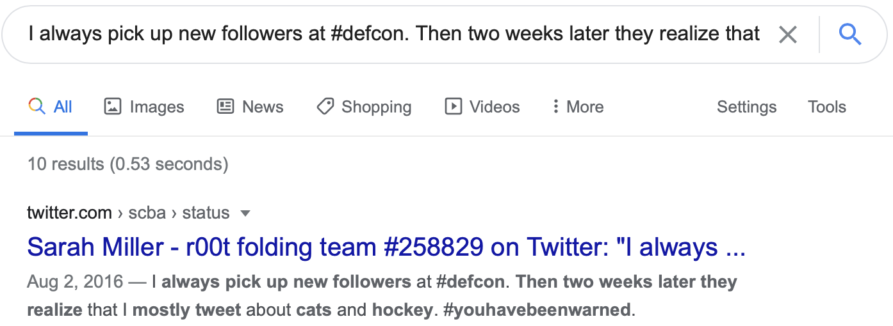
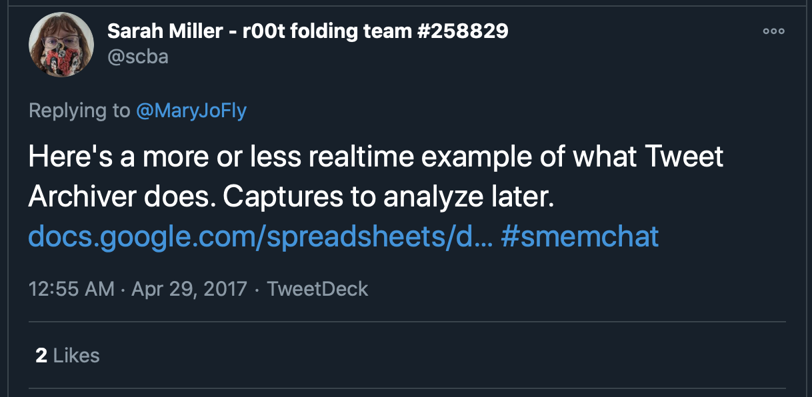

# Writeups - OSINT and Social Engineering

## Challenges

| S/N               | Real Name                                                    |
| ----------------- | ------------------------------------------------------------ |
| osint-challenge-1 | [What is he working on? Some high value project?](#what-is-he-working-on-some-high-value-project) |
| osint-challenge-2 | [Where was he kidnapped?](#where-was-he-kidnapped)           |
| osint-challenge-3 | [Who are the possible kidnappers?](#who-are-the-possible-kidnappers) |
| osint-challenge-4 | [Treasure Media](#treasure-media)                            |
| osint-challenge-5 | [X marks the spot](#x-marks-the-spot)                        |
| osint-challenge-6 | [Only time will tell!](#only-time-will-tell)                 |
| osint-challenge-7 | [Sounds of freedom!](#sounds-of-freedom)                     |
| osint-challenge-8 | [Hunt him down!](#hunt-him-down)                             |
| se-challenge-1    | [Can you trick OrgX into giving away their credentials?](#can-you-trick-orgx-into-giving-away-their-credentials) |
| se-challenge-2    | [Find the last seen location of where one of the Korovax's staff is at.](#find-the-last-seen-location-of-where-one-of-the-korovaxs-staff-is-at) |
| se-challenge-3    | [Save Josh!](#save-josh)                                     |

## What is he working on? Some high value project?

1000 points - Open Source Intelligence

**DESCRIPTION**

The lead Smart Nation engineer is missing! He has not responded to our calls for 3 days and is suspected to be kidnapped! Can you find out some of the projects he has been working on? Perhaps this will give us some insights on why he was kidnapped…maybe some high-value projects! This is one of the latest work, maybe it serves as a good starting point to start hunting.

Flag is the repository name!

[Developer's Portal - STACK the Flags](https://www.developer.tech.gov.sg/communities/events/stack-the-flags-2020)

Note: Just this page only! Only stack-the-flags-2020 page have the clues to help you proceed. Please do not perform any scanning activities on www.developer.tech.gov.sg. This is not part of the challenge scope!

This challenge:

- Unlocks other challenge(s)
- Is eligible for Awesome Write-ups Award

Flag format: `govtech-csg{alphanumeric-string}`

---

We are told to visit the `Developer's Portal - STACK the Flags`:

```
https://www.developer.tech.gov.sg/communities/events/stack-the-flags-2020
```

Let's take a look at the source:

```
view-source:https://www.developer.tech.gov.sg/communities/events/stack-the-flags-2020
```

- yields 1052 lines in total.

On line `856` we see a comment:

```
<!-- Will fork to our gitlab - @joshhky -->
```

Which leads us to

```
https://gitlab.com/joshhky
```


The commit `1173a1ae` to the `korovax-employee-wiki` is the one that we are interested in:

```
https://gitlab.com/korovax/korovax-employee-wiki/-/commit/1173a1ae90edc05618850f73f02569e657af95a1
```

We see the answer in additions to the code, on line `8`:

```
    - The employee wiki will list what each employee is responsible for, eg, Josh will be in charge of the krs-admin-portal
```


Which yields our flag:

```
govtech-csg{krs-admin-portal}
```

Completing this challenge unlocks 2 other challenges in the Open Source Intelligence category:

- [Where was he kidnapped?](#where-was-he-kidnapped)
- [Who are the possible kidnappers?](#who-are-the-possible-kidnappers)

---

## Where was he kidnapped?

1000 points - Open Source Intelligence

**DESCRIPTION**

The missing engineer stores his videos from his phone in his private cloud servers. We managed to get hold of these videos and we will need your help to trace back the route taken he took before going missing and identify where he was potentially kidnapped!

You only have limited number of flag submissions!

*Flag Format: govtech-csg{postal_code}*

This challenge:

- Is eligible for Awesome Write-ups Award

---

For this challenge we are given 3 videos, each no longer than 5 seconds.

### [video-1.mp4](./osint-and-se-writeups.assets/bus1.png/video-1.mp4)

This video shows bus no. `117` pulling into a bus stop, with the caption `Finallllyyyyyyy...`, the person behind the camera must really have wanted to get on the bus.


The bus stop is situated opposite to an MRT station on a dual carriageway.

We can find out more about the route that the bus takes using bus route information provided by the Land Transport Authority (LTA):

```
https://www.lta.gov.sg/content/ltagov/en/map/bus.html
```

We learn that bus no. `117` operates between `Punggol Temp Interchange` and `Sembawang Interchange`, noting that along the route, the bus stops by 3 MRT stations.

- Khatib
- Yishun
- Canberra


Looking at Google Maps Street View on the bus stop opposite Khatib station, we find a match for the location.

From bus route information we now also know the bus is travelling from `Punggol Temp Interchange` toward `Sembawang Interchange`.


### [video-2.mp4](./osint-and-se-writeups.assets/bus1.png/video-2.mp4)

This video shows someone walking under a covered walkway with yellow pillars with decorative glass embeds, with the caption `Not even near the mrt... such a drag...`.


From the caption here and the bus route information we got from the previous video, we are on the hunt for the bus where the person alighted.

We turn to Google Maps Street View and look at the bus stops further down the route, and find a match at bus stop number `59501`, also known as `Blk 871`


### [video-3.mp4](./osint-and-se-writeups.assets/bus1.png/video-3.mp4)

This video shows a void deck with table/chair combo and bench, next to a small garden.


Google Maps Street View we see a ground floor matching the picture above, with `870` painted on the buildling. This is `870 Yishun Street 81` which has postal code `760870`.


Which get our flag:

```
govtech-csg{760870}
```

---

## Who are the possible kidnappers?

2000 OPEN SOURCE INTELLIGENCE

**DESCRIPTION**

Perform OSINT to gather information on the organisation’s online presence. Start by identifying a related employee and obtain more information. Information are often posted online to build the organization's or the individual's online presence (i.e. blog post). Flag format is the name of the employee and the credentials, separated by an underscore. For example, the name is Tina Lee and the credentials is MyPassword is s3cure. The flag will be govtech-csg{TinaLee_MyPassword is s3cure}

This challenge:

- Unlocks other challenge(s)
- Is eligible for Awesome Write-ups Award

Addendum:

- Look through the content! Have you looked through ALL the pages? If you believe that you have all the information required, take a step back and analyse what you have.
- In Red Team operations, it is common for Red Team operators to target the human element of an organisation. Social medias such as "Twitter" often have information which Red Team operators can use to pivot into the organisation. Also, there might be hidden portal(s) that can be discovered through "sitemap(s)"?

*I guess if you can log in with the password, then you should look at the flag format again!*

Note: engaging/contacting Ms. Miller is not in scope for this ctf.

---

We are told to gather information on a organisation, and the organisation that we should be looking into is in fact called `Korovax`.

`Korovax` was previously mentioned in a previous OSINT challenge ([What is he working on? Some high value project?](#what-is-he-working-on-some-high-value-project)). We saw that a developer `@joshhky` was working on behalf of `Korovax`.

By searching for `"Korovax"` we get hits for:

```
http://www.korovax.org/
```

- this seems to be the homepage of a vaccine manufacturer... or is it?

On the Korovax home page we see a prominently placed [Ouroboros](https://en.wikipedia.org/wiki/Ouroboros). Going with the biomedical/pandemic theme, probably another reference to the [Uroboros Virus](https://residentevil.fandom.com/wiki/Uroboros_Virus) from the [Resident Evil](https://en.wikipedia.org/wiki/Resident_Evil) universe, as we also see Korovax employees named [Albert Wesker](https://residentevil.fandom.com/wiki/Albert_Wesker), [Oswell E. Spencer](https://residentevil.fandom.com/wiki/Oswell_E._Spencer,_Earl_Spencer) and [William Birkin](https://residentevil.fandom.com/wiki/William_Birkin). 

Also, inb4 Korovax is a front for [Umbrella Corp](https://residentevil.fandom.com/wiki/Umbrella_Corporation), the content on an internal blogpost alludes to this:`https://csgctf.wordpress.com/2020/10/01/example-post/` 

As is customary we check out the `robots.txt` 

```
http://www.korovax.org/robots.txt
```

```
# If you are regularly crawling WordPress.com sites, please use our firehose to receive real-time push updates instead.
# Please see https://developer.wordpress.com/docs/firehose/ for more details.

Sitemap: https://csgctf.wordpress.com/sitemap.xml
Sitemap: https://csgctf.wordpress.com/news-sitemap.xml

User-agent: *
Disallow: /wp-admin/
Allow: /wp-admin/admin-ajax.php
Disallow: /wp-login.php
Disallow: /wp-signup.php
Disallow: /press-this.php
Disallow: /remote-login.php
Disallow: /activate/
Disallow: /cgi-bin/
Disallow: /mshots/v1/
Disallow: /next/
Disallow: /public.api/

# This file was generated on Sat, 28 Nov 2020 19:14:50 +0000
```

The sitemap.xml` in the `robots.txt` provides us with a listing of all links within the site:

```
https://csgctf.wordpress.com/sitemap.xml
```

Extracted links from `sitemap.xml`:

```
https://csgctf.wordpress.com/never-gonna/
https://csgctf.wordpress.com/in-your-dreams-alfred/
https://csgctf.wordpress.com/team/
https://csgctf.wordpress.com/oh-ho/
https://csgctf.wordpress.com/contact/
https://csgctf.wordpress.com/2020/10/01/example-post/
https://csgctf.wordpress.com/2020/10/01/example-post-3/
https://csgctf.wordpress.com/2020/10/01/example-post-2/
https://csgctf.wordpress.com/
https://csgctf.wordpress.com/2020/10/22/important/
https://csgctf.wordpress.com/2020/10/22/improved-helpdesk-experience/
https://csgctf.wordpress.com/2020/10/21/new-tool-i-found/
https://csgctf.wordpress.com/2020/10/21/potatoes/
https://csgctf.wordpress.com/2020/10/16/korovaxs-antibody-cocktail-kvn-eb1-krimzeb-is-first-fda-approved-treatment-for-ebola-zaire-ebolavirusin-a-large-clinical-trial-krimzeb-showed-superiority-compared-to-other-investigational/
https://csgctf.wordpress.com/about/
https://csgctf.wordpress.com/about-2/
https://csgctf.wordpress.com/blog/
https://csgctf.wordpress.com
```


The question mentions that we should be looking into social media, leading us to pat special attention to the `/oh-ho/` page

```
https://csgctf.wordpress.com/oh-ho/
```

- this page is notable as it contains a link to the internal Korovax social media page:

  - `http://fb.korovax.org/`

- and a mention of a user forgetting their password to the internal site, and a possible path to retrieve the password/credentials based on tweet activity.

  


We begin looking at the Korovax internal social media site:

```
http://fb.korovax.org/
```


Anyone can get access by creating an account. No email verification is required.

Once we get in, we get to peek at the content posted by staff members at Korovax, as well as the interactions between them.

Upon account creation, we are led to a page listing all the users of `http://fb.korovax.org`

- alternatively, click the `Find Friends` button in the top ribbon.

```
http://fb.korovax.org/users
```

The list of users is a bit of a mess now, as many users were created by players during the course of the CTF. 

Here is what an user's page looks like:


In the Intro section of a profile we see details on each user, some of these come into play later.

AFAIK, here are the actual users that are linked to Korovax.

| URL                            | Fullname       | Email Address                | DOB        |
| ------------------------------ | -------------- | ---------------------------- | ---------- |
| http://fb.korovax.org/users/4  | Oswell Spencer | oswell.e.spencer@korovax.org | 1923-10-14 |
| http://fb.korovax.org/users/5  | William Birkin | william.birkin@korovax.org   | 1998-09-30 |
| http://fb.korovax.org/users/6  | Albert Wesker  | albert.wesker@korovax.org    | 2002-03-07 |
| http://fb.korovax.org/users/7  | david david    | david@korovax.org            | 1920-10-10 |
| http://fb.korovax.org/users/8  | sarah Miller   | sarah.miller@korovax.org     | 1989-10-19 |
| http://fb.korovax.org/users/9  | ashley lim     | ashley_lim@korovax.org       | 1997-10-17 |
| http://fb.korovax.org/users/10 | Amanda Lee     | amanda.lee@korovax.org       | 1986-10-18 |
| http://fb.korovax.org/users/11 | Linda Melo     | lindasales@korovax.org       | 1974-12-30 |

Now our task is to identify which of these user's tweets are we supposed to look into to find the password to their account at `http://fb.korovax.org`.

First we have to identify which of these users even have Twitter activity.

Googling for `[Fullname] Twitter` was too noisy for my liking and didn't get me anywhere, so I started observing the content that each user posted on their wall at `http://fb.korovax.org`. This wasn't too hard to do as each Korovax user had no more than 10 posts.

The content on Sarah Miller's wall stood out as the most resembling Twitter content, with the common Twitter pagination method of `1/2`, `2/2` being present in her content.


In a practice not exclusive to Twitter, we also see the use of hashtags:


Googling for these tweets will eventually lead you to Sarah Miller's Twitter account.



We get additional confirmation from a post on the internal blog:

```
https://csgctf.wordpress.com/2020/10/01/example-post-3/
```

which states at the end:

```
For more information, visit http://www.KoroVax.org and connect with us on Twitter @scba and LinkedIn
```

Let's take a look at Sarah Miller's Twitter:

```
https://twitter.com/scba
```


Now, recall what we saw on the `/oh-ho/` page:

```
you found me!

I forgot my password to our KoroVax social media page.

I think it’s stored on our corporate page with …blue…something….communication…

Cant remember now. Would have to look through my archived tweets!
```

and the flag format:

```
The flag will be govtech-csg{TinaLee_MyPassword is s3cure}
```

From the above we can summarise that we are probably looking for a 3-word phrase `blue-xxx-communication`, somewhere in an archived tweet.

The mention of  `archived tweets` should cause us to pay attention to another internal blog post that's also one of the links listed in `sitemap.xml`.  

```
https://csgctf.wordpress.com/2020/10/21/new-tool-i-found/
```

The blogpost is authored by Sarah Miller, and in it she recommends the use of a tool called `Tweet Archiver`. So we might want to the lookout for activity related to this.


Using the Twitter search term `@scba blue` eventually lands us on this tweet.

```
https://twitter.com/search?q=%40scba%20blue
```

```
https://twitter.com/scba/status/858009339642077186
```


We see a phrase `Blue sky communications` that seems to fit the bill as her password.

We also found her email `sarah.miller@korovax.org` earlier when browsing the user pages on `http://fb.korovax.org`. 

We can verify that we got the correct answer by attempting to login to `http://fb.korovax.org` with her email and password.

Great success:


This one was a tough nut to crack. (this explains the presence of numerous addenda in the challenge description)

```
govtech-csg{SarahMiller_Blue sky communications}
```

Completing this challenge unlocks 1 other challenge in the Social Engineering category:

- [Can you trick OrgX into giving away their credentials?](#can-you-trick-orgx-into-giving-away-their-credentials) (se-challenge-1)

### Alternate method

This approach was probably an intended solution, whereby we would have pivoted off the term `Twitter Archiver` that was mentioned in the internal blogpost `https://csgctf.wordpress.com/2020/10/21/new-tool-i-found/` and performed a search  on the `@scba` account.

Which would have resulted us in this tweet where Sarah gives an actual example of the tool in action:

```
https://twitter.com/scba/status/858001647611428864
```



```
https://docs.google.com/spreadsheets/d/1qZ2fI-MNU4ay1jU5fVB1VrOAmcazH5L_XJCD0mGCbsI/edit?usp=sharing
```

- Google Spreadsheet titled `SMEMCHAT Archive` containing 290 tweets with the hashtag `#smemchat` archived by `@scba` .
- Containing information on the tweet such as:
  - Date
  - Screen Name
  - Full Name
  - Tweet Text
  - Tweet ID
  - etc...

Once we apply a filter on the Screen Name to only show the tweets by `@scba`, we are left with a lot more manageable number of tweets to look through, just 17.


Among these 17 tweets is the one containing the 3-word phrase which is our answer.

**Note**: Searching for `Twitter Archiver` as mentioned exactly in Sarah's internal blogpost would have not have landed us on the tweet we needed. This is because she refers to the tool as `Tweet Archiver`.

### Rabbit Holes and Red Herrings  

In the sitemap was a page titled `Protected: Important`:

```
https://csgctf.wordpress.com/2020/10/22/important/
```


The password to this turned out to be

```
ouroboros
```

Andd... we get nothing at all:


Given that the question did ask us to look for a password:


### Rabbit Holes and Red Herrings 2 - Electric Boogaloo

In no particular order of frustration generated:

- drawing a non-existent link between `Blue sky communications` and `Sarah Miller`
- OSINT-ing the heck out multiple companies in different continents named `Blue Sky Communications`
- looking up all her profiles across a plethora of sites:
  - Instagram
  - LinkedIn
  - Slideshare
  - and so much more... she's active.
- Special mention: Having to consider heading to the dark web for Sarah's Miller credentials/info that were involved in past breaches, for examples: her payment card info from the data breach of the Dickeys barbecue restaurant chain

https://twitter.com/scba/status/1317246791725637633


---

## Can you trick OrgX into giving away their credentials?

2000 SOCIAL ENGINEERING

**DESCRIPTION**

With the information gathered, figure out who has access to the key and contact the person. 

This challenge:

- Unlocks other challenge(s) 
- Is eligible for Awesome Write-ups Award
- Prerequisite for Mastery Award - Chief Human Hacker

---

This challenge is the first in the Social Engineering category.

Bearing this in mind,  it would benefit us to switch gears and look for avenues where we can apply active measures to get our answers.

One of the most common methods of social engineering is phishing via emails. From earlier use of the internal site `http://fb.korovax.org`, we gather a list of potential email targets.

| URL                            | Fullname       | Email Address                | DOB        |
| ------------------------------ | -------------- | ---------------------------- | ---------- |
| http://fb.korovax.org/users/4  | Oswell Spencer | oswell.e.spencer@korovax.org | 1923-10-14 |
| http://fb.korovax.org/users/5  | William Birkin | william.birkin@korovax.org   | 1998-09-30 |
| http://fb.korovax.org/users/6  | Albert Wesker  | albert.wesker@korovax.org    | 2002-03-07 |
| http://fb.korovax.org/users/7  | david david    | david@korovax.org            | 1920-10-10 |
| http://fb.korovax.org/users/8  | sarah Miller   | sarah.miller@korovax.org     | 1989-10-19 |
| http://fb.korovax.org/users/9  | ashley lim     | ashley_lim@korovax.org       | 1997-10-17 |
| http://fb.korovax.org/users/10 | Amanda Lee     | amanda.lee@korovax.org       | 1986-10-18 |
| http://fb.korovax.org/users/11 | Linda Melo     | lindasales@korovax.org       | 1974-12-30 |

However, sending emails to these accounts above only yields a generic 'thank you for trying' reply from `ouroboros@korovax.org` 


It's good to know that the mail server is up and running but it seems like we are barking up the wrong email address.

Let's delve into the posts on `http://fb.korovax.org` to find a more apt target.

But on William Birkin's profile (http://fb.korovax.org/users/5) that there is a conversation between William and another user about which email to send password resets requests to.


- **ictadmin@korovax.org** is then mentioned as the email to contact for password resets, and that it would only respond **<u>when there's specific content</u>**. Sounds phishy.

Most messages sent to `ictadmin@korovax.org` will yield the following reply which is rather encouraging, as it differs from the previous `thank you for trying` replies, letting us know that we are on the right track.


As this point we turn to another internal blog post, also present in `https://csgctf.wordpress.com/sitemap.xml`

```
https://csgctf.wordpress.com/never-gonna/
```

This post closely relates to letting us know how to send an email to `IT`, and vaguely alludes to the keywords being required when doing so.


From the `/never-gonna/` portion of the URL, we should have already been expecting Mr. Astley to be around the corner. And there he is, in the first letter of each line.


Now then, to send an email to `ictadmin@korovax.org` also with the full artist/title of the song we've all come to love/hate, text from the blogpost (just in case).

```
RICKROLL
Rick Astley - Never Gonna Give You Up
https://www.youtube.com/watch?v=dQw4w9WgXcQ
<blog text>
```

And we get our flag :smiley:


```
govtech-csg{CE236F40A35E48F51E921AD5D28CF320265F33B3}
```

We see a long hex string at the end, but that's for the next Social Engineering challenge that is unlocked 

-   [Find the last seen location of where one of the Korovax's staff is at.](#find-the-last-seen-location-of-where-one-of-the-korovaxs-staff-is-at)

---

## Find the last seen location of where one of the Korovax's staff is at.

2000 SOCIAL ENGINEERING

**DESCRIPTION**

The evil organisation ‘KoroVax’ has a self help chatbot for new joiners or normal employees to know more about their own organisation. Use this chatbot to ask question and find out more about information about the organisation. Try to get information out of the chatbot!

This challenge:

- Unlocks other challenge(s)
- Is eligible for Awesome Write-ups Award
- Prerequisite for Mastery Award - Chief Human Hacker

---

We are told to find a chatbot and to get location info on an employee from it.

A telegram chatbot was mentioned on the walls on multiple users on `http://fb.korovax.org/`, stating how useful it was etc. 

In particular, the following user at http://fb.korovax.org/users/7 with the very human-sounding name `david david` also made a cryptic comment with `TELEGRAM` when looking at the first letters of each line.

From the challenge that unlocked this one, we are given a hex string at the end of the email response.

```
39bc4f5150511ee7c3a703bdd615ed70f79002473d7f61d2dccfc397f7292b5e
```

This hex string that is 64-characters long is probably a SHA256 hash, let's get to trying to find a match.

```
https://md5decrypt.net/en/Sha256/#answer
```


```
eziwat
```

Searching for `eziwat` on Telegram leads us to the chatbot `@eziwat_ctf_bot`.


Unfortunately the direct approach of asking for a location using `/location` doesn't work too well. We just get keep getting the reply `Sorry, we do not have his/her location.`.

This chatbot also offers assistance with botnet functionality, and that's were the answer lay. I got started down the path with the `/employees` command.


We learn that of a VPN that Korovax uses called `CretVPN`.

Pivot off keywords from the previous response, i found that `/create` led me down the path down to the flag.


```
govtech-csg{m4cD0n4lD_5aFr4_YIsHuN}
```

Completing this challenge unlocks `Treasure Media` in the Open Source Intelligence category.

---

## Treasure Media

1000 OPEN SOURCE INTELLIGENCE

**DESCRIPTION**

Find out more information about the kidnapper. Psst, social media accounts are full of treasures… Find out where she is hiding! 

The flag format is govtech-csg{latitude,longitude}. Example Flag: govtech-csg{1.352083,103.819839} 

This challenge:

- Unlocks other challenge(s) 
- Is eligible for Awesome Write-ups Award

---

We are told to locate social media accounts for this challenge and a hiding location.

The handle `@amanda.hidden` was mentioned in a conversation on Amanda Lee's profile on the internal Korovax social media page `http://fb.korovax.org/users/10`

This leads us to Instagram.


```
https://www.instagram.com/amanda.hidden/ 
```


In her latest post, the caption reads: `Too far away. Seems like it shall be the greens.`

```
https://www.instagram.com/p/CHKZVxzHx1Y/
```


In her next to last post, she is posting from `Yishun Town Garden` and the caption states: `Greens, looks ideal`. Ideal for hiding, it turns out.

```
https://www.instagram.com/p/CHEzdK2nAwE/
```


Next it was on to finding out the exact coordinates of the location she was posting from.

Instagram supports an internal list of geotag locations, and clicking onto `Yishun Town Garden` brings us to it's own Instagram page showing content with the same geotag.

```
https://www.instagram.com/explore/locations/347850915763401/yishun-town-garden/
```

- the page does contain these two tantalising lines in the page source. Unfortunately these weren't the coordinates that we were looking for.

```
<meta property="place:location:latitude" content="1.4281756250002" />
<meta property="place:location:longitude" content="103.83748033125" /
```

Heading to google we try to find the right set of coordinates for `Yishun Town Garden`, unfortunately none of these worked as well.

```
Yishun Town Garden
https://goo.gl/maps/i1PHzLF5TNkZuhVA9
1.4257614,103.8357212

Yishun Town Garden 399 Yishun Ave 2, Yishun Town Garden, Singapore
https://goo.gl/maps/Npaiqy4rBwoq5Xd29
1.4256396,103.8356342

Yishun Town Garden
https://goo.gl/maps/g3xbrq9StSAX1E6s9
1.4257627,103.835174
```

Even the coordinates from [OneMap](https://www.onemap.sg/) (that claims to provide the most detailed, **authoritative** and timely updated map of Singapore...), didn't work. 


With the coordinates from Instagram, multiple Google Map markers and OneMap failing to hit home... 


We then proceeded to submit all locations in the Yishun vicinity containing any greenery whatsoever and place names containing any semblance of green (or it's various shades)

selected entries:

```
Yishun Emerald 20 Canberra Dr, Singapore 768425
Yishun Green Link Yishun Street 61
Yishun Greenwalk
Yishun River Green HDB Flats
Yishun River Green Playground
Yishun Park
Yishun Pond
Yishun Pond Park lookout tower
Khatib Bongsu Nature Park
Springleaf Green 58 Springleaf Cres
...
```

But after many clicks of the `Submit` button, self doubt entered the game:

- did we even get the right location to being with ?
- is this even really a 1000 point (easy) question ?
- are we even looking at the correct social media account ?

Only after moving away from Google Maps we found our answer using `latlong.net` and the address of the park itself `399 Yishun Ave 2, Singapore 769094`.


One of the more painful challenges, much elation was experienced when we were done with this one.

````
govtech-csg{1.429420,103.834831}
````

This challenge unlocks another one in the Open Source Intelligence category: [X marks the spot](#x-marks-the-spot)

---

## X marks the spot

2000 OPEN SOURCE INTELLIGENCE

**DESCRIPTION**

The authorities received the details and arrived at the reported location. However, it seems like they were a few hours late and the kidnappers had shifted location. The kidnappers left behind a paper with a weird snake logo…? 

What is the postal code of the next location?

You only have limited number of flag submission!

*Flag Format: govtech-csg{postalcode}*

This challenge:

- Is eligible for Awesome Write-ups Award

---

Weird snakes... where have we seen a weird snake before... 

On the Korovax home page we see a prominently placed [Ouroboros](https://en.wikipedia.org/wiki/Ouroboros). Going with the biomedical/pandemic theme, probably another reference to the [Uroboros Virus](https://residentevil.fandom.com/wiki/Uroboros_Virus) from the [Resident Evil](https://en.wikipedia.org/wiki/Resident_Evil) universe, as we also see Korovax employees named [Albert Wesker](https://residentevil.fandom.com/wiki/Albert_Wesker), [Oswell E. Spencer](https://residentevil.fandom.com/wiki/Oswell_E._Spencer,_Earl_Spencer) and [William Birkin](https://residentevil.fandom.com/wiki/William_Birkin). 

Also, inb4 Korovax is a front for [Umbrella Corp](https://residentevil.fandom.com/wiki/Umbrella_Corporation), the content on an internal blogpost alludes to this:`https://csgctf.wordpress.com/2020/10/01/example-post/` 

```
https://csgctf.files.wordpress.com/2020/10/da94ee34360415.56da4e9cd71e8.jpg
```


Also mentioned on Amanda's profile on the Korovax internal social media page (`http://fb.korovax.org/users/10`) is a mosaic created by her and posted on:

```
https://www.picturemosaics.com/photo-mosaic-tool/share/id/M2066502/p/p0
```


It's also the subject of one of her [Instagram](https://www.instagram.com/amanda.hidden/) posts.

```
https://www.instagram.com/p/CGrYTwoHqEc/
```


It took a really keen eyed member of the team to notice something fishy about the mosaic, in the top-left corner...


Why yes Mr Macgyver, i do:


From the answer to `Find the last seen location of where one of the Korovax's staff is at.`, we know to place the starting point at `McDonald's SAFRA Yishun`.

And by our images combined (using a tool such as GIMP to add transparency/overlay):


We get our postcode searching for `Yishun`:


```
govtech-csg{760925}
```

We have now unlocked the final Social Engineering challenge [Save Josh!](https://github.com/teokiameng/stack-the-flag-ctf-2020/blob/main/osint-and-se-writeups.md#save-josh)

---

## Save Josh!

2000 SOCIAL ENGINEERING

**DESCRIPTION**

We have Josh's location, but the secret code is wrong?! Give KoroVax a call and get the updated secret code.

Also, what are the 2 key influencing techniques used by Amanda to obtain information from Josh? Include the techniques used, in lower case alphabetic order. For example, if the updated secret code is 987654321 and the techniques used are drunk and blabbering, the flag to submit is: govtech-csg{987654321_drunk_blabbering}

*Flag Format: govtech-csg{[secret_code]_[technique]_[technique]}*

This challenge:

- Is eligible for Awesome Write-ups Award
- Prerequisite for Mastery Award - Chief Human Hacker

---

Here we are told to call KoroVax and get an updated secret code.

We can find the number we need from Google

```
3138 8139
```


Upon dialling the phone number, we learn it's an automated voice system and we are asked for 2 forms of verification:

- Employee ID
- Date of Birth

But which employee?

About date of birth information, we have previously seen plenty of Korovax employees' DOB info on their profiles in the internal social media `http://fb.korovax.org/` But Amanda is the one that we will focus on.

Amanda also has her birthday listed on her [Instagram](https://www.instagram.com/amanda.hidden/) profile:


In this post she mentions losing her employee pass:

```
https://www.instagram.com/p/CGoXOFiH3Iv/
```


And in the post right after she posts her newly-replaced Korovax staff pass like the boss babe she is:

```
https://www.instagram.com/p/CGoYNZhnzsf/
```


QR code at the bottom right gives us:

```
Employee ID 1473909801
```

Now we have all we need to access the voice system.

This is the current call tree for the Korovax automated voice system

- **Pre-verification**
  - Employee ID, followed by `#`
    - `1473909801#`
  - Date of Birth, followed by `#`
    - `18101986#`
- **Post-verification**
  - Press 1 for project related matters 
    - `1`
      - Enter project number, followed by #
        - [**???**]
  - Press 2 to connect to team operation hotline  
    - `2`
      - We are given a recording of Amanda speaking to another employee 'Josh', she plays the role of an overbearing coworker to get Josh to somewhat reluctantly provide details on project.

The voicemail doesn't give us anything the lines of an `updated secret code`.

We go back to our telegram bot `@eziwat_ctf_bot` that we first used in the challenge `Find the last seen location of where one of the Korovax's staff is at.`.

One of the suggested commands `/projects` gives us the codes we need:


Upon entering the project codes into the voice system, we are prompted for a corresponding postal code for the project.

Using `760925` from the previous challenge `X marks the spot` works for Project Code `2992734` and we get our updated project code.

Here's what the complete call tree looks like.

- **Pre-verification**
  - Employee ID, followed by `#`
    - `1473909801#`
  - Date of Birth, followed by `#`
    - `18101986#`
- **Post-verification**
  - Press 1 for project related matters 
    - `1`
      - Enter project number, followed by #
        - `2932242#`
        - `2394442#`
        - `3029382#`
        - `2992734`
          - **Enter postal code**
            - `760925#`
              - We are told the updated project code is **81337**
        - `38720391`
  - Press 2 to connect to team operation hotline  
    - `2`
      - We are given a recording of Amanda speaking to another employee 'Josh', she plays the role of an overbearing coworker to get Josh to somewhat reluctantly provide details on project.

As for the techniques we Amanda used to coerce Josh into giving up sensitive information, we get the technique names from chatbot `@eziwat_ctf_bot` using the command `/setechniques`


We get our flag and Josh is saved! :slightly_smiling_face:

```
govtech-csg{81337_authority_obligation}
```

---


## Only time will tell!

1000 OPEN SOURCE INTELLIGENCE

**DESCRIPTION**

This picture was taken sent to us! It seems like a bomb threat! Are you able to tell where and when this photo was taken? This will help the investigating officers to narrow down their search! All we can tell is that it's taken during the day!

If you think that it's 7.24pm in which the photo was taken. Please take the associated 2 hour block. This will be 1900-2100. If you think it is 10.11am, it will be 1000-1200.

Flag Example: govtech-csg{1.401146_103.927020_1990:12:30_2000-2200}

Use this [calculator](https://www.pgc.umn.edu/apps/convert/)!

*Flag Format: govtech-csg{lat_long_date_[two hour block format]}*

This challenge:

- Unlocks other challenge(s)
- Is eligible for Awesome Write-ups Award
- Prerequisite for Mastery Award - Intelligence Officer

Addendum:

- The amount of decimal places required is the same as shown in the example given.
- CLI tool to get something before you convert it with the calculator.

---

We are given `osint-challenge-6.jpg`

It's a photo taken from of the Speakers' Corner sign in Hong Lim Park, with the PARKROYAL COLLECTION Pickering hotel in the background.

```
Hong Lim Park, New Bridge Rd, Singapore 059299
https://goo.gl/maps/DZ4gmUVNzqGmr2iG6
PARKROYAL COLLECTION Pickering, Singapore, 3 Upper Pickering St, Singapore 058289
https://goo.gl/maps/q3GeRnjqcLM8ujcD6
```


Let's take a look at image [EXIF](https://en.wikipedia.org/wiki/Exif) data using the good ol' [ExifTool](https://exiftool.org/), we see GPS coordinates.


Using the calculator as mentioned in the challenge description, we get the coordinates in the format we want. 


Coordinates in hand, now to get the date and time.

We isolate the barcode into a separate image and use a reader such as the one found on https://online-barcode-reader.inliteresearch.com/.


The barcode reads

```
25 October 2020
```


Now we have to find the time...

We can see that the sun is shining high above the hotel in the background.

From the starting point in Google Maps we can plot a line from the EXIFdata to the approximate location of the hotel across the street. We then see how it lines up with the Sun on that day and time using `suncalc.org`, once again inputting the same starting coordinates we got from the EXIF data.

```
https://www.suncalc.org/#/1.2866,103.8468,18/2020.10.25/16:00/1/3
```


The input time of 4pm into `suncalc.org` seems to match that of the picture. We then use `1500-1700` as the time range.

It works!

```
govtech-csg{1.286647_103.846836_2020:10:25_1500-1700}
```

Completing this challenge unlocks another challenge in Open Source Intelligence: [Sounds of freedom!](#sounds-of-freedom)

---

## Sounds of freedom!

1000 OPEN SOURCE INTELLIGENCE

**DESCRIPTION**

In a recent raid on a suspected COViD hideout, we found this video in a thumbdrive on-site. We are not sure what this video signifies but we suspect COViD's henchmen might be surveying a potential target site for a biological bomb. We believe that the attack may happen soon. We need your help to identify the water body in this video! This will be a starting point for us to do an area sweep of the vicinity!

*Flag Format: govtech-csg{postal_code}*

This challenge:

- Unlocks other challenge(s)
- Is eligible for Awesome Write-ups Award
- Prerequisite for Mastery Award - Intelligence Officer

---

We are given a 12-second video `osint-challenge-7.mp4`, it's just a a vertical pan up and down. We see it's from pretty high up, next to a road with a bus stop, overlooking a waterbody with a little shack close to it.


Previous challenge ([Where was he kidnapped?](#where-was-he-kidnapped)) focused on the Punggol/Yishun/Sembawang area so we could prioritise our search on water bodies in those areas with matching features.

Or, we could get lucky and have someone in your team actually stay near the park in question:

```
Punggol Park, Hougang Ave 10, Singapore 538768
https://goo.gl/maps/JdkVWyimhPQAmFcW7
```


Using Street View we verify our guess using the only bus stop adjacent to the park:


```
govtech-csg{538768}
```

Completing this challenge unlocks another Open Source Intelligence challenge:[Hunt him down!](#hunt-him-down)

---

## Hunt him down!

1000 OPEN SOURCE INTELLIGENCE

**DESCRIPTION**

After solving the past two incidents, COViD sent a death threat via email today. Can you help us investigate the origins of the email and identify the suspect that is working for COViD? We will need as much information as possible so that we can perform our arrest!

Example Flag: govtech-csg{JohnLeeHaoHao-123456789-888888}

*Flag Format: govtech-csg{fullname-phone number[9digits]-residential postal code[6digits]}*

This challenge:

- Is eligible for Awesome Write-ups Award
- Prerequisite for Mastery Award - Intelligence Officer

---

We are given an email [osint-challenge-8.eml](osint-and-se-writeups.assets\osint-challenge-8.eml)

[osint-challenge-8.eml](osint-and-se-writeups.assets\osint-challenge-8.eml) 

[.eml](https://en.wikipedia.org/wiki/EML) is an file extension that emails are commonly saved as. Thankfully this wasn't one of the propietary ones, the file size isn't too large, so we are able to view it just by using `cat`

```bash
$ file osint-challenge-8.eml 
osint-challenge-8.eml: ASCII text, with CRLF line terminators
$ ls -sh osint-challenge-8.eml 
4.0K osint-challenge-8.eml
```

```bash
$ cat osint-challenge-8.eml 
X-Pm-Origin: internal
X-Pm-Content-Encryption: end-to-end
Subject: YOU ARE WARNED!
From: theOne <theOne@c0v1d.cf>
Date: Fri, 4 Dec 2020 21:27:07 +0800
Mime-Version: 1.0
Content-Type: multipart/mixed;boundary=---------------------9d9b7a65470a533c33537323d475531b
To: cyberdefenders@panjang.cdg <cyberdefenders@panjang.cdg>

-----------------------9d9b7a65470a533c33537323d475531b
Content-Type: multipart/related;boundary=---------------------618fd3b1e5dbb594048e34eeb9e9fcdb

-----------------------618fd3b1e5dbb594048e34eeb9e9fcdb
Content-Type: text/html;charset=utf-8
Content-Transfer-Encoding: base64

PGRpdj5USEVSRSBXSUxMIEJFIE5PIFNFQ09ORCBDSEFOQ0UuIEJFIFBSRVBBUkVELjwvZGl2Pg==
-----------------------618fd3b1e5dbb594048e34eeb9e9fcdb--
-----------------------9d9b7a65470a533c33537323d475531b--
```

Interesting headers to take note of:

```
Subject: YOU ARE WARNED!
From: theOne <theOne@c0v1d.cf>
To: cyberdefenders@panjang.cdg <cyberdefenders@panjang.cdg>
```

The message (body) of the email:

```
PGRpdj5USEVSRSBXSUxMIEJFIE5PIFNFQ09ORCBDSEFOQ0UuIEJFIFBSRVBBUkVELjwvZGl2Pg==
```

- Looks like a base64 encoded string from the trailing `==`

Let's decode the message `PGRpdj5USEVSRSBXSUxMIEJFIE5PIFNFQ09ORCBDSEFOQ0UuIEJFIFBSRVBBUkVELjwvZGl2Pg==`. 

We can use `base64` or CyberChef for this.

base64

```bash
$ echo "PGRpdj5USEVSRSBXSUxMIEJFIE5PIFNFQ09ORCBDSEFOQ0UuIEJFIFBSRVBBUkVELjwvZGl2Pg==" | base64 -d
<div>THERE WILL BE NO SECOND CHANCE. BE PREPARED.</div>
```

CyberChef

```
https://gchq.github.io/CyberChef/#recipe=From_Base64('A-Za-z0-9%2B/%3D',true)&input=UEdScGRqNVVTRVZTUlNCWFNVeE1JRUpGSUU1UElGTkZRMDlPUkNCRFNFRk9RMFV1SUVKRklGQlNSVkJCVWtWRUxqd3ZaR2wyUGc9PQ
```

- output:

```
<div>THERE WILL BE NO SECOND CHANCE. BE PREPARED.</div>
```


We see that the mail is from `theOne@c0v1d.cf`. Let's see if we can find any information about the sender's domain.

We start with [WHOIS](https://en.wikipedia.org/wiki/WHOIS) information, hoping to find information on domain ownership that might be useful for us.

```bash
$ whois c0v1d.cf
   
   Domain name:
      C0V1D.CF

   Organisation:
      Centrafrique TLD B.V.
      Dot CF administrator
      P.O. Box 11774
      1001 GT  Amsterdam
      Netherlands
      Phone: +31 20 5315725
      Fax: +31 20 5315721
      E-mail: abuse: abuse@freenom.com, copyright infringement: copyright@freenom.com

   Domain Nameservers:
      NS01.FREENOM.COM
      NS02.FREENOM.COM
      NS03.FREENOM.COM
      NS04.FREENOM.COM


   Your selected domain name is a Free Domain. That means that,
   according to the terms and conditions of Free Domain domain names
   the registrant is Centrafrique TLD B.V.

   Due to restrictions in Dot CF 's Privacy Statement personal information
   about the user of the domain name cannot be released.

   ABUSE OF A DOMAIN NAME
   If you want to report abuse of this domain name, please send a
   detailed email with your complaint to abuse@freenom.com.
   In most cases Dot CF responds to abuse complaints within one business day.

   COPYRIGHT INFRINGEMENT
   If you want to report a case of copyright infringement, please send
   an email to copyright@freenom.com, and include the full name and address of
   your organization. Within 5 business days copyright infringement notices
   will be investigated.

   Record maintained by: Dot CF Domain Registry
```

- Unfortunately nothing seems to be of use here.

Another way to obtain information a domain is via enumerating it's DNS records. We already saw that `c0v1d.cf` was use to send email, so who know that they at least have MX records configured at some point. Who know what other DNS records we might find?

A good tool for this is [dnsrecon](https://github.com/darkoperator/dnsrecon) 

### dnscrecon

Quick installation for Ubuntu:

```bash
sudo apt install dnsrecon -y
```

We use `-d` to specify our target domain and `-n` to specify the name server to use.

```
dnsrecon -d c0v1d.cf -n 8.8.8.8
```

The tools works to retrieving a variety of DNS information across different DNS record types (SOA, NS, etc.) but it is the TXT record that stands out.

Notably no MX records were found.


```
TXT c0v1d.cf user=lionelcxy contact=lionelcheng@protonmail.com
```

From here we begin searching on the email and username

We get his full name from LinkedIn and take note of the display pic which reeks of [heresy](https://1d4chan.org/wiki/Heresy). 

```
https://www.linkedin.com/in/cheng-xiang-yi-0a4b891b9/
```


His Instagram mentions his Strava account:

- Strava is a fitness app commonly used for tracking running and cycling activities etc.

```
https://www.instagram.com/lionelcxy/
https://www.instagram.com/p/CG9SXu_siGz/
```


```
https://www.strava.com/athletes/70911754
```

- Lionel's Strava account contains `2` activities, of which 1 mentions getting `home`, but that he made a detour to get some food.


```
https://www.strava.com/activities/4243139774
```

- He mentions `Social Space` - the name of a cafe as we see later and how it was already closed and that it shared the same block as his home.


- The activity description mentions that his block was at the same address as `Social Space`:

```
Social Space closes so early. It was just at my block...
```


We get the the postal code of the Social Space outlet at his part of town:

```
018935
```

Now we have to get his phone number...

Doing a literal search of his username reveals that it also exists on the ~~Carouhell~~ Carousell platform.

```
https://www.carousell.sg/lionelcxy
```


It doesn't seem to have any listings at the moment.. but the internet remembers.

If we go down the list of Google search results we see his phone number in historical listings.


```
963672918
```

With these 3 pieces of information we get our flag.

```
govtech-csg{LionelChengXiangYi-963672918-018935}
```

---

